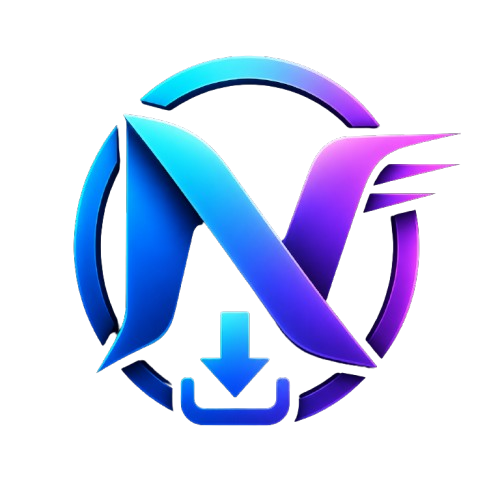

<div align="center">



# NovaFetch

**Download anything. Faster.**

A modern, dark-themed desktop download manager for Windows — YouTube videos & playlists, direct files, and more — built with Electron, React and TypeScript.


**YouTube** · **Direct HTTP files** · **Parallel chunk downloads** · **Resume & retry** · **Windows taskbar progress**

</div>

---

## 📸 Screenshots

> Replace these placeholders with real captures of the app.

| Downloads view | Details panel |
| :---: | :---: |
|  |  |

| New download dialog | Statistics dashboard |
| :---: | :---: |
|  |  |

---

## ✨ Features

### ⚙️ Download Engine

- **Two engines, one queue** — YouTube content is downloaded with the bundled `yt-dlp`, while direct HTTP(S) files use a purpose-built native Node.js engine.
- **Parallel chunk downloads** — large files are split into up to 4 concurrent byte-range connections for much faster transfer.
- **Resume support** — interrupted downloads resume from where they left off (`.partN` chunks + `.partinfo` metadata, validated against the server's ETag / Last-Modified).
- **Integrity verification** — merged files are size-checked and checksum-verified (`Content-MD5` when available) before being atomically renamed to their final name.
- **Smart redirect handling** — CDN-signed URLs (GitHub releases, etc.) are resolved through redirect chains before downloading; the signed URL is never persisted.
- **Automatic retries** — failed chunks retry with exponential backoff (up to 3 attempts per chunk).

### ▶️ YouTube

- **Video & playlist support** — videos, playlists, shorts, live URLs, embeds, and `youtu.be` links are all recognized.
- **Rich metadata preview** — title, uploader, duration, thumbnail, and a full format list before you download.
- **Format selection** — pick from every available format, with a smart "best" heuristic (highest resolution, MP4 preferred, then bitrate).
- **Playlist browser** — preview every entry with availability status (private / removed / region-blocked detected and surfaced).
- **Automatic browser cookies** — optionally sign in to YouTube automatically using cookies from an installed browser (Chrome, Edge, Brave, or Firefox) — no manual cookie export needed, with automatic failover.

### 🖥️ UI

- **Dark, polished interface** — a modern single-window layout with sidebar navigation.
- **Live progress everywhere** — per-download progress bars, smoothed speed, ETA, and byte counts.
- **Real-time connection monitor** — watch each parallel chunk's host and speed live.
- **Detailed per-download panel** — General, Progress, Files, Connections, and Logs tabs.
- **Statistics dashboard** — total / active / completed / failed / queued counts, plus Today / Week / Month / All-Time transfer cards, speed graph, and connection chart.
- **Full download management** — pause, resume, stop, retry, priority, and multi-select batch actions.
- **Context menus** — open, open folder, copy URL, copy file path, and more right on each row.
- **Search & filtering** — instant search across titles and URLs, plus status filters on the History page.
- **Drag & drop** — drop a URL onto the window to start a download.
- **Clipboard detection** — a detected URL in your clipboard triggers a quick-add prompt.
- **Desktop notifications** — native Windows notifications on completion or failure, plus an in-app notification center.
- **Keyboard shortcuts** — `Ctrl+N` new download, `Ctrl+F` search, space to pause/resume, `Delete` to remove, and more.

### 📈 Performance

- **Concurrent downloads** — configurable parallel queue (defaults to 3 at once).
- **Multi-connection single-file speed** — parallel byte ranges maximize throughput on large files.
- **Throttled UI updates** — progress events are rate-limited and speed is smoothed (EWMA) so the UI stays responsive.
- **Efficient list rendering** — memoized virtualized rows keep hundreds of downloads smooth.

### 🔄 Update System

- **Manifest-based update checks** — the app fetches a JSON update manifest, compares semantic versions, and prompts when a new release exists.
- **Startup check** — one check after launch, gated by an *Auto update* preference.
- **Forced updates** — a manifest can flag an update as required, producing a non-dismissible dialog with a single **Update Now** action.
- **Release notes** — shown directly in the update dialog.

### 🛡️ Safety

- **Atomic file finalization** — the final file name only ever appears as a complete, verified file (never a partial download).
- **Temp-artifact hygiene** — `.part` / `.partinfo` / `.resume` files are tracked and cleaned; thumbnails live in the temp dir and are wiped on exit.
- **Disk-space awareness** — free-space checks before large downloads.
- **Friendly error mapping** — cryptic engine errors become readable messages ("Private video", "Age-restricted content", "Region blocked", DNS/timeout errors, and more).
- **Single-instance lock** — only one running instance, second launches focus the existing window.

---

## 🧰 Tech Stack

| Layer | Technology |
| :--- | :--- |
| Runtime | [Electron](https://www.electronjs.org/) 39 |
| UI | [React](https://react.dev/) 19 |
| Language | [TypeScript](https://www.typescriptlang.org/) 5.9 |
| Build tooling | [electron-vite](https://electron-vite.org/) 5 (Vite 7) |
| Styling | [Tailwind CSS](https://tailwindcss.com/) 4 |
| State | [Zustand](https://zustand.docs.pmnd.rs/) |
| Icons | [lucide-react](https://lucide.dev/) |
| Animation | [framer-motion](https://www.framer.com/motion/) |
| Testing | [Vitest](https://vitest.dev/) |
| Video extraction | [yt-dlp](https://github.com/yt-dlp/yt-dlp) (bundled) |
| Media processing | FFmpeg / FFprobe (bundled) |

---

## 🏗️ Architecture

NovaFetch follows the standard Electron three-process split, with a clean boundary between the download engine and the UI.

```
┌────────────────────────────────────────────────────────────┐
│                        Renderer (React)                    │
│   Pages · Components · Zustand stores · IPC bridge         │
└───────────────────────────┬────────────────────────────────┘
                            │ contextBridge (preload)
┌───────────────────────────▼────────────────────────────────┐
│                        Main process                        │
│                                                            │
│  ┌──────────────────────────────────────────────────────┐  │
│  │                  Download Engine                    │  │
│  │  DownloadQueue → DownloadManager → DownloadTask      │  │
│  │        ├── YtDlpEngine (YouTube via yt-dlp)         │  │
│  │        └── HttpEngine (parallel chunk downloads)    │  │
│  │  EventBus → progress / completed / failed / log      │  │
│  └──────────────────────────────────────────────────────┘  │
│                                                            │
│  UpdateService (manifest check) · SettingsService          │
│  TaskbarProgress · ThumbnailManager · Native notifications │
└────────────────────────────────────────────────────────────┘
```

**Key design decisions**

- **URL routing in the main process** — `DownloadTask` inspects each URL, resolves redirect chains for CDN links, then selects `YtDlpEngine` (anything YouTube) or `HttpEngine` (direct HTTP files). The renderer never touches engine internals.
- **Everything is observable** — the `DownloadEventBus` pushes typed events to the renderer; the Windows taskbar aggregate and native notifications are driven from the same stream.
- **Resume-first temp handling** — chunk files and resume metadata are kept after interruptions, and only removed after a fully verified merge (or explicit user discard).

---

## 📁 Folder Structure

<details>
<summary><b>Click to expand the project tree</b></summary>

```text
nova-fetch/
├── electron/                        # Main process (Node.js)
│   ├── main.ts                      # App bootstrap, window, single-instance lock
│   ├── preload.ts                   # contextBridge API (window.electronAPI / window.electron)
│   ├── ipc/                         # IPC handlers
│   │   ├── download.ipc.ts          #   download lifecycle, metadata, files, taskbar
│   │   ├── settings.ipc.ts          #   app settings
│   │   ├── update.ipc.ts            #   update check + update config
│   │   ├── clipboard.ipc.ts         #   clipboard URL monitoring
│   │   └── safeHandle.ts            #   safe wrapper around ipcMain.handle
│   └── services/
│       ├── downloader/              # Download engine
│       │   ├── downloadQueue.ts     #   concurrency-limited queue
│       │   ├── downloadManager.ts   #   task registry
│       │   ├── downloadTask.ts      #   URL routing → engine selection
│       │   ├── ytDlpEngine.ts       #   YouTube engine (spawns yt-dlp)
│       │   ├── httpEngine.ts        #   parallel chunk download engine
│       │   ├── httpDownloader.ts    #   single-stream HTTP downloader
│       │   ├── metadataService.ts   #   YouTube metadata extraction
│       │   ├── playlistMetadataService.ts # playlist extraction
│       │   ├── progressParser.ts    #   yt-dlp progress line parser
│       │   ├── browserCookies.ts    #   auto browser cookie resolution
│       │   ├── thumbnailManager.ts  #   ffmpeg frame → data-URL thumbnail
│       │   ├── taskbarProgress.ts   #   Windows taskbar aggregate
│       │   ├── diskSpace.ts         #   free-space checks
│       │   ├── downloadStoreService.ts # persisted download list
│       │   └── eventBus.ts          #   main→renderer event stream
│       ├── settingsService.ts       # persisted app settings
│       └── update*.ts               # update manifest, version compare, startup check
├── src/                             # Renderer (React)
│   ├── main.tsx                     # React entry
│   ├── app/App.tsx                  # root component
│   ├── layout/                      # Sidebar · Toolbar · StatusBar · AppLayout
│   ├── pages/                       # Downloads · Scheduled · Completed · History
│   ├── features/
│   │   ├── dialogs/                 # New download, format selector, playlists, update, …
│   │   ├── download/components/     # rows, context menu, dashboard, graphs
│   │   ├── details/components/      # General · Progress · Files · Connections · Logs
│   │   ├── settings/                # Settings dialog
│   │   └── notifications/           # Notification center
│   ├── components/common/           # Button · Card · Toast · SplitPane · …
│   ├── hooks/                       # useUpdate · useSearch · useThumbnail
│   ├── lib/                         # url-parser · format · speed-smoother · shortcuts
│   ├── store/                       # Zustand stores
│   ├── services/                    # ThumbnailService
│   └── types/                       # Shared domain types
├── resources/                       # Bundled assets
│   ├── yt-dlp.exe · ffmpeg.exe · ffprobe.exe
│   └── icon.ico · icon.png
├── electron.vite.config.ts
├── vitest.config.ts
├── package.json
└── tsconfig*.json
```

</details>

---

## 🚀 Installation

### Prerequisites

- [Node.js](https://nodejs.org/) 22+ and npm
- Windows (the packaged app targets Windows x64)

```bash
# 1. Install dependencies
npm install

# 2. Run the development build
npm run dev
```

> The `resources/` directory ships with `yt-dlp.exe`, `ffmpeg.exe`, and `ffprobe.exe` — no
> separate setup is required for YouTube or media processing.

---

## 💻 Development

| Command | Description |
| :--- | :--- |
| `npm run dev` | Launch the app in development mode (hot reload, DevTools) |
| `npm run typecheck` | Type-check main + renderer (`typecheck:node` / `typecheck:web`) |
| `npm test` | Run the Vitest test suite |
| `npm run lint` | ESLint over the project |
| `npm run format` | Prettier formatting |

### Useful shortcuts during development

- **`Ctrl+N`** — open the new download dialog
- **`Ctrl+F`** — focus search
- **Space** — pause / resume the selected download
- **`Delete`** — remove the selected finished download

---

## 📦 Build for Production

```bash
# Type-check + build main, preload, and renderer bundles
npm run build

# Unpacked app (out/ + release/win-unpacked)
npm run build:unpack

# Windows installer (NSIS)
npm run build:win
```

The Windows build produces an NSIS installer (`NovaFetch-1.0.0-Setup.exe`) with optional
per-user install, custom install directory, and start-menu shortcuts.

---

## 🔄 Auto Update

NovaFetch has a built-in, manifest-based update system (independent of any updater SDK):

1. **Check** — on startup (gated by the *Auto update* preference, enabled by default) the app
   fetches an update manifest from a configurable URL (`NOVAFETCH_UPDATE_URL`, or the
   built-in default) and parses/validates it:

   ```json
   {
     "latestVersion": "1.1.0",
     "minimumSupportedVersion": "1.0.0",
     "forceUpdate": false,
     "downloadUrl": "",
     "releaseNotes": ["…"]
   }
   ```

2. **Compare** — semantic version comparison decides whether the installed version is behind.
3. **Prompt** — if an update is available, an **Update Available** dialog appears with the
   current/latest versions and release notes.
   - Optional updates are dismissible (Later / close / Escape / backdrop click).
   - **Forced updates** (`forceUpdate: true`) show a single **Update Now** action and cannot
     be dismissed — the dialog stays visible until the update starts.
4. **Version gating** — the manifest can also declare a `minimumSupportedVersion` for future
   compatibility checks.

> **Status:** detection and prompting are implemented. The download/install step that starts
> after clicking **Update Now** is a planned milestone (see Roadmap).

---

## 🗺️ Roadmap

- [x] Core download engine (YouTube via yt-dlp + native HTTP engine)
- [x] Parallel chunk downloads with resume & integrity verification
- [x] Update detection with optional / forced update dialogs
- [ ] Wire **Update Now** to download & install the update
- [ ] `minimumSupportedVersion` enforcement (block unsupported installs)
- [ ] Time-based scheduling for downloads
- [ ] macOS / Linux installers
- [ ] More granular settings (defaults, concurrent downloads, theme)

---

## ❓ FAQ

<details>
<summary><b>What can NovaFetch download?</b></summary>

YouTube videos and playlists (via the bundled `yt-dlp`) and direct HTTP/HTTPS files (via the
built-in chunked download engine).
</details>

<details>
<summary><b>Does it require installing yt-dlp or FFmpeg?</b></summary>

No — both `yt-dlp.exe` and `ffmpeg.exe`/`ffprobe.exe` are bundled in `resources/` and resolved
automatically in dev and packaged builds.
</details>

<details>
<summary><b>Why do some YouTube videos fail with "authentication required"?</b></summary>

YouTube sometimes demands sign-in (bot checks, age gates, private content). Enable browser
cookies in **Settings → YouTube cookies** and sign in to YouTube in your browser; NovaFetch
will use those cookies automatically.
</details>

<details>
<summary><b>Where are downloads saved?</b></summary>

You choose the folder per download (defaulting to your system Downloads folder). Your download
list and settings are persisted in the app's user-data directory.
</details>

<details>
<summary><b>Is NovaFetch available on macOS or Linux?</b></summary>

Not yet — the current build configuration targets Windows x64 (NSIS installer).
</details>

<details>
<summary><b>Can I pause and resume a download?</b></summary>

Yes. Direct-file downloads resume from the exact byte offset via chunk metadata; YouTube
downloads resume via yt-dlp's `--continue` behavior.
</details>

---

## 🤝 Contributing

Contributions are welcome! Here's how to get started:

1. **Fork** the repository and create a branch from `main`.
2. **Install** dependencies with `npm install`.
3. **Develop** with `npm run dev`.
4. **Validate** your changes:
   - `npm run typecheck` — no type errors
   - `npm test` — all tests pass
   - `npm run lint` — clean lint
5. Open a **pull request** with a clear description of the change.

Please keep changes focused, add tests for new behavior, and follow the existing code style
(Prettier: single quotes, no semicolons, 100-char width).

---

## 📄 License

This project does not currently declare a license. All rights reserved until a license is
chosen by the maintainers.

---

## ⭐ Support

Like NovaFetch? Here's how you can help:

- **Star this repository** — it's free and helps others discover the project.
- **Report issues** — found a bug or a missing feature? Open an issue with reproduction steps.
- **Share your feedback** — feature requests and design feedback are always appreciated.

---

<div align="center">

**Built with ❤️ using Electron, React and TypeScript**

[Back to top](#novafetch)

</div>
